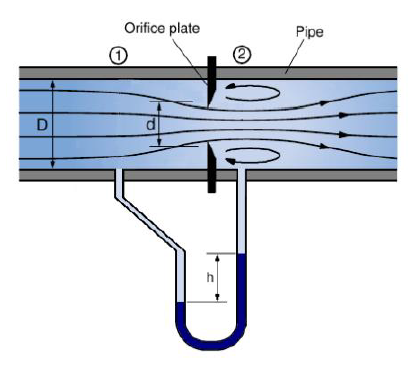
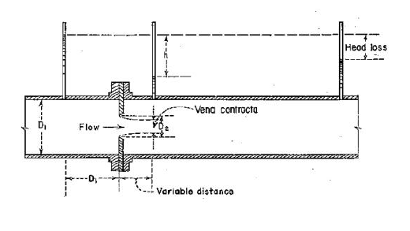

An orifice is a small opening of regular shape provided in the side or bottom of a tank or vessel through which a liquid flows under the action of gravity. The liquid surface in the tank is maintained above the top edge of the opening, producing a pressure head that causes the fluid to emerge as a free jet. Orifices are widely used for measuring and controlling the discharge of liquids in hydraulic structures and engineering systems.

The flow of liquid through an orifice is governed by the principle of conservation of energy. As the liquid passes through the opening, its pressure energy is converted into kinetic energy, resulting in the formation of a high-velocity jet. The theoretical velocity of the jet can be determined using Bernoulli's theorem.

Bernoulli's equation states that the total mechanical energy of a steady, incompressible, and frictionless fluid flowing along a streamline remains constant. Considering the free surface of the liquid in the tank and the centre of the orifice, the equation may be written as

$$
\frac{P_1}{\rho g}
+
\frac{V_1^2}{2g}
+
Z_1
===

\frac{P_2}{\rho g}
+
\frac{V_2^2}{2g}
+
Z_2.
$$

Where:

- $P$ = Pressure of the fluid, $\mathrm{N/m^2}$,
- $\rho$ = Density of the fluid, $\mathrm{kg/m^3}$,
- $V$ = Velocity of flow, $\mathrm{m/s}$,
- $g$ = Acceleration due to gravity, $\mathrm{m/s^2}$,
- $Z$ = Elevation above a reference datum, $\mathrm{m}$.

For a large tank open to the atmosphere,

- The pressure at the free surface and at the orifice is atmospheric,
- The velocity of the liquid at the free surface is negligible,
- The difference in elevation between the free surface and the centre of the orifice is the head, $H$.

Under these conditions, Bernoulli's equation simplifies to

$$
V_t=\sqrt{2gH},
$$

which is known as Torricelli's theorem. Here,

- $V_t$ = Theoretical velocity of the jet,
- $H$ = Head of liquid above the centre of the orifice.

The theoretical discharge through the orifice is given by

$$
Q_t=A\sqrt{2gH},
$$

where

- $Q_t$ = Theoretical discharge,
- $A$ = Area of the orifice.

In actual practice, the fluid experiences friction and other energy losses, and the jet contracts after leaving the orifice. As a result, the actual discharge is less than the theoretical discharge. The ratio of the actual discharge to the theoretical discharge is called the coefficient of discharge and is given by

$$
C_d=\frac{Q_a}{Q_t},
$$

where

- $Q_a$ = Actual discharge,
- $Q_t$ = Theoretical discharge.

The coefficient of discharge depends on two other important coefficients:

$$
C_d=C_c\times C_v,
$$

where

- $C_c$ = Coefficient of contraction,
- $C_v$ = Coefficient of velocity.

The coefficient of contraction accounts for the reduction in the cross-sectional area of the jet after it passes through the orifice, while the coefficient of velocity accounts for the difference between the actual and theoretical velocities of the jet.

<em>Figure 1: Flow of water through an orifice showing the formation of the jet and vena contracta.</em>

When water flows through an orifice, the jet contracts to a minimum cross-sectional area at a short distance from the opening. This section is known as the **vena contracta**, where the velocity is maximum and the pressure is atmospheric. Beyond this point, the jet gradually expands as it travels through the air.

The experimental setup consists of a water tank fitted with an orifice at one side. Water is allowed to flow through the orifice under a constant head, and the actual discharge is determined by collecting the water in a measuring tank over a known interval of time. The theoretical discharge is calculated using Bernoulli's equation, and the coefficient of discharge is obtained by comparing the actual and theoretical values.

<em>Figure 2: Experimental setup for determining the coefficient of discharge of an orifice.</em>

The study of orifice flow is of considerable importance in hydraulic engineering. Orifices are commonly used in tanks, reservoirs, water distribution systems, irrigation structures, and flow-measuring devices. The determination of the coefficient of discharge provides valuable information for the design and analysis of hydraulic structures involving the controlled release of fluids.
